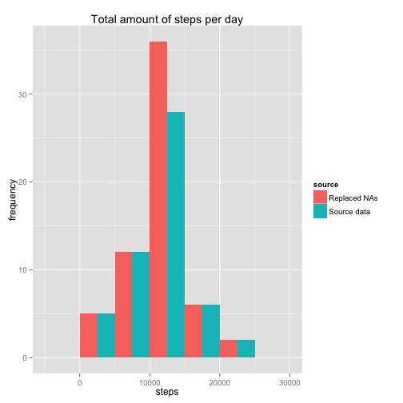
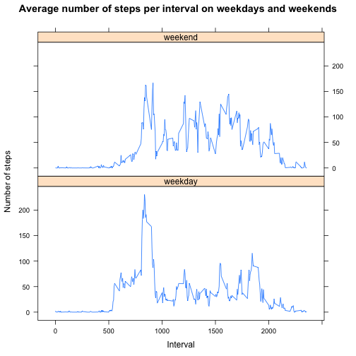

# Reproducible Research: Peer Assessment 1


## Loading and preprocessing the data
Load required libraries.

```r
library(ggplot2)
library(lattice)
```

> 1. Load the data (i.e. read.csv())
Read the data and display some information about the data set. Keep the date 
values as strings for now with `stringsAsFactors = FALSE`.  

```r
df <- read.csv("activity.csv", na.strings = "NA", stringsAsFactors = FALSE)
head(df)
```

```
##   steps       date interval
## 1    NA 2012-10-01        0
## 2    NA 2012-10-01        5
## 3    NA 2012-10-01       10
## 4    NA 2012-10-01       15
## 5    NA 2012-10-01       20
## 6    NA 2012-10-01       25
```

```r
str(df)
```

```
## 'data.frame':	17568 obs. of  3 variables:
##  $ steps   : int  NA NA NA NA NA NA NA NA NA NA ...
##  $ date    : chr  "2012-10-01" "2012-10-01" "2012-10-01" "2012-10-01" ...
##  $ interval: int  0 5 10 15 20 25 30 35 40 45 ...
```

```r
summary(df)
```

```
##      steps           date              interval   
##  Min.   :  0.0   Length:17568       Min.   :   0  
##  1st Qu.:  0.0   Class :character   1st Qu.: 589  
##  Median :  0.0   Mode  :character   Median :1178  
##  Mean   : 37.4                      Mean   :1178  
##  3rd Qu.: 12.0                      3rd Qu.:1766  
##  Max.   :806.0                      Max.   :2355  
##  NA's   :2304
```

> 2. Process/transform the data (if necessary) into a format suitable for your analysis

Transform the date column to a proper Date data type.

```r
df$date <- as.Date(df$date, format = "%Y-%m-%d")

# aggregate the total steps per day
steps_per_day <- aggregate(df$steps, by = list(df$date), sum)
names(steps_per_day)[1] <- "day"
names(steps_per_day)[2] <- "steps"
head(steps_per_day)
```

```
##          day steps
## 1 2012-10-01    NA
## 2 2012-10-02   126
## 3 2012-10-03 11352
## 4 2012-10-04 12116
## 5 2012-10-05 13294
## 6 2012-10-06 15420
```

```r
# gather the total steps per interval ignoring the NA values
steps_per_interval <- aggregate(df$steps, by = list(df$interval), sum, na.rm = TRUE, 
                                na.action = NULL)
names(steps_per_interval)[1] <- "interval"
names(steps_per_interval)[2] <- "steps"
head(steps_per_interval)
```

```
##   interval steps
## 1        0    91
## 2        5    18
## 3       10     7
## 4       15     8
## 5       20     4
## 6       25   111
```

```r
# calculate the mean steps for each interval
mean_steps <- aggregate(df$steps, by = list(df$interval), mean, na.rm = TRUE, 
                        na.action = NULL)
names(mean_steps)[1] <- "interval"
names(mean_steps)[2] <- "mean_steps"
# round the mean steps to a whole number since we can't take fractional steps
#mean_steps$mean_steps <- round(mean_steps$mean_steps, digits=0)
head(mean_steps)
```

```
##   interval mean_steps
## 1        0    1.71698
## 2        5    0.33962
## 3       10    0.13208
## 4       15    0.15094
## 5       20    0.07547
## 6       25    2.09434
```
## What is mean total number of steps taken per day?
> 
> For this part of the assignment, you can ignore the missing values in the dataset.
>
> 1. Make a histogram of the total number of steps taken each day
> 

_Histrogram of the total number of steps taken each day_

```r
hist(steps_per_day$steps, main = "Total number of steps per day", xlab = "Steps per day")
```

 
>  
> 2. Calculate and report the mean and median total number of steps taken per day
>  

_Mean and Median steps per day_

```r
mean_median <- c(mean(steps_per_day$steps, na.rm = TRUE), median(steps_per_day$steps, na.rm = TRUE))
names(mean_median) <- c("mean", "median")
mean_median
```

```
##   mean median 
##  10766  10765
```
## What is the average daily activity pattern?
>
> 1. Make a time series plot (i.e. type = "l") of the 5-minute interval (x-axis) and the average number of steps taken, averaged across all days (y-axis)
>

_Time series plot of the 5-minute intervals and the average number of steps taken, averaged against all days._

```r
plot(mean_steps$interval, mean_steps$mean_steps, type = "n",
     main = "Average steps taken per 5-minute interval",
     xlab = "5-minute intervals", ylab = "Average number of steps taken")
lines(mean_steps$interval, mean_steps$mean_steps, type = "l")
```

 

> 2. Which 5-minute interval, on average across all the days in the dataset, contains the maximum number of steps?

_The 5-minute interval with the maximum number of steps._

```r
mean_steps[which.max(mean_steps$mean_steps), 1]
```

```
## [1] 835
```

## Imputing missing values
> 1. Calculate and report the total number of missing values in the dataset (i.e. the total number of rows with NAs)

_The total number of missing values in the dataset:_

```r
sum(is.na(df$steps))
```

```
## [1] 2304
```

> 2. Devise a strategy for filling in all of the missing values in the dataset. The strategy does not need to be sophisticated. For example, you could use the mean/median for that day, or the mean for that 5-minute interval, etc.

_Using the mean for the interval, fill in the missing values._

```r
# merge the original dataset with the mean steps per interval set
fixed_data <- merge(df, mean_steps, by = "interval", sort = FALSE)
# now plug in the mean_steps value for the missing NA values
fixed_data$steps[is.na(fixed_data$steps)] <- fixed_data$mean_steps[is.na(fixed_data$steps)]
head(fixed_data)
```

```
##   interval steps       date mean_steps
## 1        0 1.717 2012-10-01      1.717
## 2        0 0.000 2012-11-23      1.717
## 3        0 0.000 2012-10-28      1.717
## 4        0 0.000 2012-11-06      1.717
## 5        0 0.000 2012-11-24      1.717
## 6        0 0.000 2012-11-15      1.717
```

```r
# since the steps are now fractional, let's round them to whole steps
fixed_data$steps <- round(fixed_data$steps, digits = 0)

# we no longer need the mean_steps column from the fixed_data set, so remove that column
fixed_data$mean_steps <- NULL
head(fixed_data)
```

```
##   interval steps       date
## 1        0     2 2012-10-01
## 2        0     0 2012-11-23
## 3        0     0 2012-10-28
## 4        0     0 2012-11-06
## 5        0     0 2012-11-24
## 6        0     0 2012-11-15
```
> 3. Create a new dataset that is equal to the original dataset but with the missing data filled in.

Create a new copy of the dataset with the missing data filled in.

```r
# note that the columns are not in the correct order
# original data frame
head(df)
```

```
##   steps       date interval
## 1    NA 2012-10-01        0
## 2    NA 2012-10-01        5
## 3    NA 2012-10-01       10
## 4    NA 2012-10-01       15
## 5    NA 2012-10-01       20
## 6    NA 2012-10-01       25
```

```r
# fixed up data frame
head(fixed_data)
```

```
##   interval steps       date
## 1        0     2 2012-10-01
## 2        0     0 2012-11-23
## 3        0     0 2012-10-28
## 4        0     0 2012-11-06
## 5        0     0 2012-11-24
## 6        0     0 2012-11-15
```

```r
# create a new data frame with the correctly ordered columns
df_fixed <- fixed_data[, c(2, 3, 1)]
```

> 4. Make a histogram of the total number of steps taken each day and Calculate and report the mean and median total number of steps taken per day. Do these values differ from the estimates from the first part of the assignment? What is the impact of imputing missing data on the estimates of the total daily number of steps?


```r
steps_per_day_new <- aggregate(df_fixed$steps, by = list(df_fixed$date), sum)
names(steps_per_day_new)[1] <- "day"
names(steps_per_day_new)[2] <- "steps"
```

_Histrogram of the total number of steps taken each day_


```r
hist(steps_per_day_new$steps, main = "Total number of steps per day (missing data replaced)", 
     xlab = "Steps per day")
```

 


Comparing the fixed data set with the old data set.

Here is a side-by-side histogram of the new data with replaced NAs vs the original data set


```r
steps_per_day$src = "Source data"
steps_per_day_new$src = "Replaced NAs"
combined_steps <- rbind(steps_per_day, steps_per_day_new)
names(combined_steps) <- c("date", "steps", "source")
source <- c(steps_per_day$src, steps_per_day_new$src)
qplot(steps, data = combined_steps,
    geom = "histogram",
    fill = source,
    position = position_dodge(),
    main = "Total amount of steps per day",
    xlab = "steps",
    ylab = "frequency",
    binwidth = 5000)
```

 

_Mean and Median steps per day_

```r
mean_median_new <- c(mean(steps_per_day_new$steps, na.rm = TRUE), 
                     median(steps_per_day_new$steps, na.rm = TRUE))
names(mean_median_new) <- c("mean", "median")
# Mean and Median with NA replacement
mean_median_new
```

```
##   mean median 
##  10766  10762
```

```r
# original Mean and Median
mean_median
```

```
##   mean median 
##  10766  10765
```

```r
# calculate percent change = (NEW-OLD)/OLD
percent_change <- (mean_median_new["median"] - mean_median["median"]) / mean_median["median"]
```

The Mean with replacement estimated values is equal to the original Mean taken while ignoring NA values.

The Median is a little bit lower when using NA replacement. 

The percent change in the Median when using NA replacement is:


```r
percent_change
```

```
##     median 
## -0.0002787
```

## Are there differences in activity patterns between weekdays and weekends?

> 1. Create a new factor variable in the dataset with two levels – “weekday” and “weekend” indicating whether a given date is a weekday or weekend day.


```r
df_fixed$weekdays <- factor(format(df_fixed$date, "%A"))
levels(df_fixed$weekdays)
```

```
## [1] "Friday"    "Monday"    "Saturday"  "Sunday"    "Thursday"  "Tuesday"  
## [7] "Wednesday"
```

```r
# make a new column to hold the weekday/weekend designation
df_fixed$weekday_designation <- df_fixed$weekdays

# replace with weekday/weekend designations
levels(df_fixed$weekday_designation) <- list(weekday = c("Monday", "Tuesday", "Wednesday", "Thursday", "Friday"),
                                weekend = c("Saturday", "Sunday"))

levels(df_fixed$weekday_designation)
```

```
## [1] "weekday" "weekend"
```
> 2. Make a panel plot containing a time series plot (i.e. type = "l") of the 5-minute interval (x-axis) and the average number of steps taken, averaged across all weekday days or weekend days (y-axis). 


```r
# aggregate the new data in steps per interval
steps_per_interval_new <- aggregate(df_fixed$steps, by = list(df_fixed$weekday_designation,
                                                              df_fixed$interval), 
                                    mean, na.rm = TRUE, na.action = NULL)
names(steps_per_interval_new)[1] <- "weekday"
names(steps_per_interval_new)[2] <- "interval"
names(steps_per_interval_new)[3] <- "mean_steps"

head(steps_per_interval_new)
```

```
##   weekday interval mean_steps
## 1 weekday        0     2.2889
## 2 weekend        0     0.2500
## 3 weekday        5     0.4000
## 4 weekend        5     0.0000
## 5 weekday       10     0.1556
## 6 weekend       10     0.0000
```

```r
xyplot(steps_per_interval_new$mean_steps ~ steps_per_interval_new$interval |
       steps_per_interval_new$weekday,
       layout = c(1, 2), type = "l",
       main = "Average number of steps per interval on weekdays and weekends",
       xlab = "Interval",
       ylab = "Number of steps")
```

 
